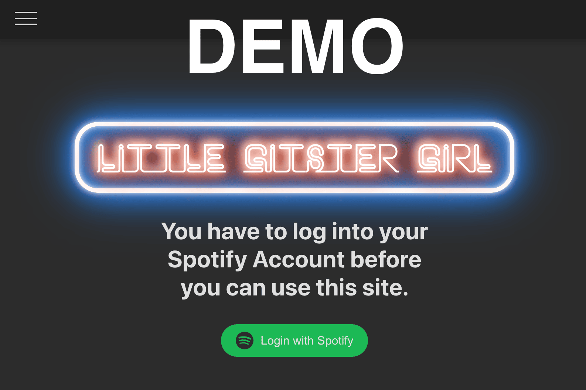

[](https://github.com/FlorianDe/little-gitster-girl/actions/workflows/run-build.yml)
[](https://github.com/FlorianDe/little-gitster-girl/actions/workflows/run-test.yml)

# Little Gitster Girl

**Little Gitster Girl** is an engaging and interactive game designed for music lovers and friends who enjoy testing their knowledge of music release dates. Players compete to guess whether a song was released before or after previously played cards, creating a fun and challenging experience. Additionally, this app empowers users to generate personalized playing cards based on their Spotify playlists, enhancing gameplay and fostering music discovery.

[](https://floriande.github.io/little-gitster-girl/)
[Click image or here for demo]((https://floriande.github.io/little-gitster-girl/))

## Table of Contents
- [Little Gitster Girl](#little-gitster-girl)
  - [Table of Contents](#table-of-contents)
  - [Features](#features)
  - [Development](#development)
    - [Getting started](#getting-started)
      - [Prerequisites](#prerequisites)
      - [Installation](#installation)
      - [Running the App](#running-the-app)
    - [Available Scripts](#available-scripts)
    - [Project Structure](#project-structure)
  - [Contributing](#contributing)
    - [Code Style](#code-style)
   
## Features 

-	🎵 **Interactive Gameplay**: A unique guessing game where players arrange songs based on their release dates, promoting a fun way to explore music history.
-	🎤 **Spotify Integration**: Seamlessly connect to your Spotify account to access your playlists and track information. _**Spotify Premium Required**_. 
-	🃏 **Custom Playing Cards**: Generate and print playing cards from your Spotify playlists, allowing for personalized gameplay.
-	🏆 **Multiplayer Experience**: Challenge friends in a friendly competition to see who knows their music best.
-	🌐 **User-Friendly Interface**: Intuitive design ensures that players of all ages can join in on the fun.

## Development

### Getting started
To run this project locally, follow these steps.

#### Prerequisites
- **Node.js** (version 14 or above)
- **npm** or **yarn** package manager
- **Spotify Developer account** for API access (to get your `client_id`. This project uses the PKCE auth flow of Spotify, so you dont need the client_secret.)
You also have to add the redirect URI for local development which would be `http://localhost:3000/little-gitster-girl`.
Spotify tutorial for these steps: https://developer.spotify.com/documentation/web-api/concepts/apps 

#### Installation
1. **Clone the repository**
```bash
git clone https://github.com/FlorianDe/little-gitster-girl.git
cd little-gitster-girl
```
2.	Install dependencies
```bash
npm install
# or
yarn install
```

3.	Set up environment variables
Copy or rename the .env.example file
```bash
cp .env.example .env.local
```
And change the YOUR_SPOTIFY_CLIENT_ID_HERE placeholder with your obtained `client_id`.

#### Running the App
```bash
npm run dev
# or
yarn dev
```

The app will be available at `http://localhost:3000/little-gitster-girl`.
You can change the port and the base-name inside the vite.config.ts but be aware that you also have to change the value for the `VITE_REDIRECT_TARGET` inside your env variable and also think about the redirect urls declared inside your spotify app (inside the dashboard).

### Available Scripts

- npm run dev – Runs the app in development mode.
- npm run dev:https – Runs the app in development mode with HTTPS.
- npm test – Launches the test runner.
- npm run build – Builds the app for production.
- npm run preview - Serves the production build as preview.
- npm run lint – Checks the code for linting errors.
- npm run generate-certs – Generate the self signed certificates needed for serving the app with https locally.
  
### Project Structure
```bash
little-gitster-girl/
├── public/                 # Static assets
├── src/
│   ├── auth/               # Spotify authentication logic
│   ├── components/         # Reusable UI components
│   ├── context/            # Context providers (e.g., Toast, SpotifyWebPlayer)
│   ├── hooks/              # Custom hooks for reusable logic (e.g. useCameraPermission)
│   ├── i18n/               # Translation specific context, provider, hooks, translations
│   ├── routes/             # Page-level components
│   ├── services/           # Pdf generation and spotify-related logic
│   ├── utils/              # Utility functions
│   └── config.ts           # Config file for global settings
├── .env                    # Environment variables
└── README.md
```

## Contributing

Please follow these steps:

1.	Fork the repository.
2.	Create a branch: git checkout -b feature/your-feature-name.
3.	Commit your changes: git commit -m 'Add new feature'.
4.	Push to the branch: git push origin feature/your-feature-name.
5.	Create a Pull Request.

### Code Style
- Use Prettier for consistent code formatting.
- Use ESLint for linting, and ensure all lint issues are resolved.